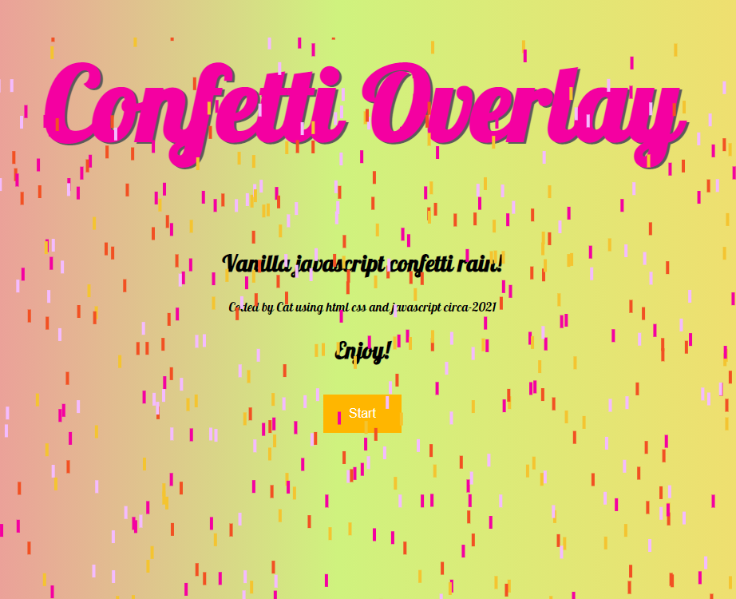

Vanilla Javascript Confetti
---
Using vanilla javascript "Canvas" to overlay screen text with confetti tumbling down the screen when start button is pressed.

- For an extra effect used color gradient for background
- If you press the Start button multiple times confetti gets faster - for fun
- Javascript uses query selectors, event listeners, a constructor for the overlay, canvas animation, and fill/clear rect functions.

Here is a screenshot:

